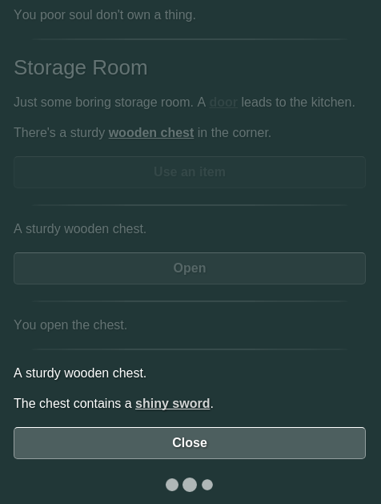

# Toothrot Engine

[](https://gitter.im/iiyo/toothrot?utm_source=badge&utm_medium=badge&utm_campaign=pr-badge&utm_content=badge)


An engine for creating text-based games.

Toothrot Engine allows you to create interactive fiction, parser-less text adventures or other
text-based games. The games are written in an eye-friendly text-based format (similar to Markdown)
and allow writing your game logic in JavaScript.

To develop games with this engine, basic knowledge of JavaScript and HTML is recommended,
though not required for simple choice-based or hypertext games.

## Screenshots



## Features

 * Markdown-like format for writing games
 * Different modes of interaction:
   * Regular links (like known from Twine)
   * Option menus (like in ChoiceScript or in visual novels)
   * Going to the next node by clicking or pushing a button (like in visual novels)
 * Customizable screen system written in regular HTML and CSS with default screens:
   * Main screen
   * Pause screen
   * Savegame screen
   * Settings screen
 * Savegame system with slots, auto-save and quick save/load
 * Text nodes can also be things in the simple world model, e.g. rooms, items or persons
 * Text nodes can be tagged and put into a hierarchy
 * Text nodes can contain other text nodes
 * Support for mobile devices (and "add to homescreen")
 * Exports games for browsers (works without a web server) or as Windows/Mac/Linux desktop apps
 * Audio support with separate channels for sounds, ambience and music
 * Games playable using the keyboard
 * Games playable with screen readers (experimental)
 * Extensible JavaScript API
 * Speed-adjustable reveal effect for text (like in visual novels)
 * Browser builds support application cache (offline mode) out of the box

## Installation

You need Node.js to run the engine. If you don't have it installed, download it here:
[https://nodejs.org/en/download/](https://nodejs.org/en/download/)

Once you have Node.js up and running, installing toothrot is as simple as opening
a terminal window and typing the following:

    npm install -g toothrot

## Creating a new project

You can now create a new project in the terminal like this:

```
mkdir my_project
cd my_project
toothrot init
```

This will create the following files and folders in `my_project`:

```
+ files
  + style
    - default.css
    - custom.css
  - index.html
+ resources
  + screens
    - main.html
    - pause.html
    - save.html
    - settings.html
  + templates
    - confirm.html
    - notification.html
    - ui.html
  - extras.trot.ext.md
  - story.trot.md
- project.json
```

The `files/` folder contains all the files that are copied as is when you build your project.

The `resources/` folder contains files that will be packed into a `resources.js` file when
you build your project.

The folder `resources/screens/` contains HTML template files for screens. You can customize
the templates to better fit the style of your projects, or add new files here to add new
screens to your game.

The `resources/templates/` folder contains non-screen templates. Currently only `confirm.html`
is used. You can change this file to customize the appearance of confirm dialogs.

The `files/index.html` file is the main file of the project. When you build your projects for
the browser, you can double-click on this file to start the game.

You can customize your game's appearance by changing `files/style/custom.css`. Of course, you
can also add new CSS files to your `files/index.html` file.

The file `project.json` contains information about your project, e.g. for which desktop
platforms you want to build your game.

Finally, the `resources/story.md` file contains the actual story of your game.

You can change all of your project files to your liking, then build your project to run and test it.

## Building your project

To create a working game from your project, you need to build it. This can be done by writing
the following in the terminal:

    toothrot build

This will package all the resources and create a folder `my_project/build/browser/`.
To run your game, just double-click on the `index.html` file or open that file in
your browser (drag and drop usually works, too).

You can also build desktop applications from your project for Linux, Windows and Mac OS X like so:

    toothrot build-desktop

This will download a whole lot of stuff the first time you run it. If you have a slow connection,
you can go grab a coffee now. ;)

With the default settings this will built for the following platforms:

 * win32: Windows (32-bit)
 * win64: Windows (64-bit)
 * linux32: Linux (32-bit)
 * linux64: Linux (64-bit)
 * osx32: Mac OS X (32-bit)
 * osx64: Max OS X (64-bit)

You can change which platforms to build for by opening your project's `project.json` file and
editing the `platforms` property.

You can find the finished desktop builds in `my_project/build/desktop/`.


## The Story Format

Toothrot Engine comes with its own story format. It looks similar to
[markdown](https://de.wikipedia.org/wiki/Markdown) and has some special parts
to structure your story.

A basic story file looks like this:


    # My Story
    
    ## default_section
    
    
    ### start
    
    This is some text with **markdown** formating.
    
    And [this is a link to another node](#another_node). Click it.
    
    
    ### another_node
    
    This is the text of another node.
    
    (<)


A toothrot story file is divided into sections (starting with "##") and nodes
(starting with "###").

Nodes are pieces of text that are displayed one after the other. The first node is always
the `start` node.

### Next nodes

Nodes can have a next node. The next node can be reached by clicking somewhere on the screen
or by pressing either the `SPACE` or `RIGHT` button. You can specify the next node by writing
`(>) name_of_next_node` on a new line.

For example, if you want the next node of the node `my_node` to be `another_node`,
you can write it like this:

```
### my_node

Some text.

(>) another_node
```

Sometimes you will want to create many connected nodes that don't need to be accessible from
somewhere else. There's a shorthand notation for such nodes:

```
### boring_story

Once upon a time, there was a man.
***
He married a woman from another village.
***
They had a lot of children.
***
The man and the woman grew older and older.
***
Then they died.
```

In this example, we have a named node `boring_story` and a bunch of connected nodes
defined by `***`.


### Returning to the last node

A node can specify that its *next* node is the last node that was shown before the
current node. This is as easy as writing this on a new line at the end of your node:

    (<)

You can also return to the last node with a certain tag. For example, if you want to
return to the last visited node that is tagged "room", you can write:

    (<) room

For more about tags, see the section about it further below.

### Linking to other nodes

You can link to other nodes in a node's text by using this notation:

    This is a link: [click me](#another_node)

The first part between `[` and `]` is the link text or label.
The second part, between `(#` and `)` is the name of the node that will be reached
when the user clicks on the link.

### Option menus

Each text node can have an option menu. Options are displayed as buttons below the text of the node.
If you want to write a quiz game or a choice game or have dialogs like in point and click
adventures, options are probably the right thing to use.

To add an option to a text node, just write it at the end of the node's text like this:

    (@) Click me? => option_clicked

This will display a button with the text "Click me?" and, when clicked, it will go to the node
named "option_clicked".

You can also specify a value for an option:

    (@) Click me? => option_clicked | This is the value

When a user clicks on an option with a value, the chosen value will be saved in the special
variable `$._choice`. In the example above, if the user clicks the option, the `$._choice` variable
will contain the string `"This is the value"`.

Options can be shown or hidden depending on a node's flags (see the section about flags for more
info). For example, the following will show the `Open` option only when the node has a flag
`closed` set, and it will only show the `Close` option if that flag is not set on the node.

    (@) closed  ??? Open => open_container
    (@) !closed ??? Closed => close_container


### Node properties

Nodes can be given properties using the `(#)` syntax:

    ### my_node
    
    (#) key: "value"
    
    The node's text.

A line starting with `(#)` sets a property of the node. The first part after the `(#)` and
the `:` is the property name. Everything after the `:` until the end of the line is the
property's value. Values must be valid [JSON](http://json.org) values
(strings, numbers, array, objects).

Node properties can be changed at runtime of the game using scripts. Property values are
automatically saved when a savegame is created and will be restored when the savegame is
loaded.

### The world model

The world model of toothrot games is both simple and very flexible. But if you're not
familiar with parser-based interactive fiction engines like Inform, you might be wondering
what a world model is and why you would ever need one.

In a "pure" choice-based game (similar to some of the early Choose Your Own Adventure books) or
a "pure" hypertext fiction, each text node always contains the same text, no matter how the
player might have reached it. The experience of the player is unique for each set of choices
she makes, but the game (or the world of the story) itself never actually changes.

This is fine for a broad range of interactive fiction, but if you want to write a game
where the world of the story actually reacts to the actions of the player, you need some kind
of model of how the world of the game behaves to the player's input.

The world model in toothrot is not nearly as sophisticated as the world model of traditional
parser-based interactive fiction engines like Inform. Instead, it gives you a few simple
building blocks that you can use to define your own world model.

#### Giving meaning to nodes

Nodes, the fundamental building blocks in toothrot, are more than just pieces of text.

Nodes can be labeled using *tags*. With tags, you can define a node to be a room or an item,
or you can label it something else completely. The engine doesn't actually know what
a "room" or an "item" is, but it allows you to treat one kind of node differently from
another kind.

Each node can have an unlimited number of tags. Tags can be put into a hierarchy. This way you
can define, for example, that a container is an item and that both a person and an
animal are beings.

A node's internal state can be changed using so-called *flags*. A flag doesn't have a value itself,
it just defines that a fact is true or not true for a node. Options (you can think about them
as actions the player can do) can be shown or hidden depending on these flags. For example, a
node that acts as a container can have or not have a `closed` flag set and then display either
a `Close` or `Open` option depending on whether or not the flag is set.

### Scripts and slots

Simple choices or links don't cut it for your game? Then you can use JavaScript to further
customize the behavior of your game.

Each node can contain named blocks of JavaScript:

    ### my_node
    
    ```js @my_script
        "And here's some more text."
    ```
    
    Here's some text. `@my_script`
    

The above defines a script named `my_script` for the node `my_node`. This script will be executed
only if it is referenced in the node's text. Scripts can be referenced by using the slot syntax.
The "\`@my_script`" part written in the text of the node tells the engine to execute the script
`my_script` and replace the \`@my_script` with whatever the result of the script was.

If you would run the above example, the text that would be displayed is:

    Here's some text. And here's some more text.

### Special scripts

Normally, scripts are only executed if they are referenced in a node's text. But there are
some special scripts that are executed even if they are not referenced in the text.

Currently, the engine recognizes these special script names:

| Script name (`@[name]`) | Context    | Executed when?                |
|:------------------------|:-----------|:------------------------------|
| @entry                  | Node       | When entering the node        |
| @brief                  | Node       | When parent node is displayed |

You can use `@entry` to ensure a script is executed each time before the node where it
is written in gets displayed.

A `@brief` script is a little more complicated to understand. As said at the start of this README, nodes can contain other nodes. To enable the player to actually interact with the child nodes
of a node, some text must be displayed informing the player about the existence of the child node.
To accomplish this, the `@brief` script of the child is called before displaying the parent node.
The return value of the `@brief` script is then displayed right under the parent's node text.

#### Node JavaScript API

Much of a node's behavior can be controlled using the node JavaScript API.

## Variables

Variables can be inserted into a node's text by using this notation:

    The variable `foo` contains: `$foo`

Variables can be set in script blocks like this:

    ```js @entry
    $.foo = "bar";
    ```


## JavaScript

A node can contain blocks of JavaScript. The JavaScript inside a node gets executed right
before the node is shown. JavaScript can be written in the node's text between
`(!` and `!)`. The last value of the JavaScript snippet will be inserted into
the text.

### The variable container: $

Inside the JavaScript snippets, there are two main ways in which you can interact
with the engine. The first is `$`. It's an object containing all of the game's
current variables.

For example, the following snippets produce the same output:

    Foo is: `$foo`

    Foo is: (! $.foo !)

#### Special variable: $._choice

The `$._choice` variable contains the value of the last clicked option.

### The function container: _

The next way to interact with the engine from a JavaScript snippet is the
*environment* `_`. It contains a bunch of functions to alter the game's state
in some way or help you write your scripts.

#### _.skipTo(nodeId)

The `skipTo(nodeId)` function skips the current node immediately before showing
any text or effects or playing any audio. The following will skip the node where
it is written and continue with the node `foo` instead:

    _.skipTo("foo")

#### _.link(label, target)

Creates a direct link to another node:

    You can (! _.link("go to the other room", "other_room") !).

#### _.addOption(label, target[, value])

Adds an option to the node's option menu. The first parameter is the text that's displayed on
the button. The second parameter, `target`, is the target node that will be executed if the user
clicks on the option. The third parameter, `value`, is optional and can be used to specify the
options string value (see section about special variable `$._choice`).

#### _.node()

Returns the current node. 

#### _.oneOf(a1, a2, ..., aN)

Returns one of its arguments randomly:

    ```js @entry
    $.hairColor = _.oneOf("blond", "brown", "black", "red", "white", "gray");
    ```

## Node and section properties

Both nodes and sections can be augmented with properties. To add a property
to a node or section, add the following on an empty line somewhere in the
node's or section's text:

    (#) theKey: "theValue"

In this example, a property `theKey` is defined with a string value of `"theValue"`.
The value of a property can be any JSON value like `string`, `number`, `boolean`,
`array`, `object` or `null`.

If a property is defined for a section, it will affect all the nodes contained
within that section. If a property is defined for a node, it will only belong
to the node itself.

If both a node and its section define the same property, then the node's property
is used.

### Property: timeout [number]

You can specify a timeout for a node:

    (#) timeout: 2000

This means that after 2 seconds (2000 milliseconds), a choice will be made for the user:
If the node contains options but no default option is specified, the first option will
be chosen. If a default option has been specified for the node, this option will be chosen.
Finally, if the node doesn't have options but has a next node or a node to return to, the game
will go to this node instead.

### Property: defaultOption [number]

If this property is specified and the node has a timeout, the option specified here will be
chosen after the timeout instead of the first option. This property's value is the zero-based
index of the option.

    (#) defaultOption: 2

This will choose the third option.

    (#) defaultOption: 0

This will choose the first option.


## Audio

You can play audio files with Toothrot. There are three different kinds of audio,
and each has its own "channel" (meaning its own volume):

 * sound: Sounds that are played once when something happens, e.g. glass breaking, door shutting.
 * music: Looping background music.
 * ambience: Looping ambience (noise) tracks, e.g. ocean waves or restaurant chatter.

You can use node properties to play audio. To play a sound, at a `sound` property to your node:

    (#) sound: "doorShutting.ogg"

To start a background music track (or change the one currently playing), use:

    (#) music: "mainTheme.ogg"

And for playing or changing the ambience track:

    (#) ambience: "restaurant.ogg"

You can stop whatever is playing on a channel by setting it to `false`:

    (#) music: false

And if you want to stop all audio at once, use this:

    (#) audio: false

The paths to your audio files is relative to the `index.html` file of your built project.
So if you write this:

    (#) sound: "beep.ogg"

It plays the file `my_project/files/beep.ogg`. And if you write:

    (#) sound: "sounds/beep.ogg"

Then it plays `my_project/files/sounds/beep.ogg`.

If you build your project for the use in browsers, you might need to supply different formats of
the same audio file. You can specify alternatives like this:

    (#) sound: ["sounds/beep", "ogg", "mp3"]

The browser will choose the format it supports automatically, so it will either play
`my_project/files/sounds/beep.ogg` or `my_project/files/sounds/beep.mp3`.


## Customizing screens and the game UI

You will need basic HTML skills to customize your screens. You can customize your game's screens
by simply changing a screen's template. The screen templates can be found in the
`resources/screens/` folder. Likewise, you can customize the UI by editing the templates found
in `resources/templates/`.

The following default templates are available:

 * `resources/templates/confirm.html` for the confirm dialog
 * `resources/templates/notification.html` for notifications
 * `resources/templates/ui.html` for the in-game UI

### Linking from one screen to another

You can add a clickable element that will open another screen when clicked by specifying
these two attributes:

    data-type="menu-item"
    data-target="my_screen"

If the user clicks on a link or button that has these attributes, the screen defined in the
file `resources/screens/my_screen.html` will be shown.

### Making links or buttons work with keyboard navigation

To make an element in a screen navigatable, you must add the following attribute:

    data-focus-mode="screen"

To make the element also reachable by using the `tab` button (important for screen readers!),
you can add these attributes:

    tabindex="0"
    role="button"

### Showing or hiding elements depending on the platform's features

Some of the engine's features are only available if you export your game as a desktop application,
like switching to fullscreen mode or exiting the application. To ensure that screen or UI parts
referencing such features are only shown when the feature is available, you can use the
`data-feature` attribute:

    data-feature="exit"

Currently these two platform-dependent features are available: "exit" and "fullscreen".

Here's how to make a screen element quit the game when clicked:

    data-type="menu-item"
    data-target="exit"
    data-feature="exit"

And for toggling between fullscreen and window mode, you can use:

    data-type="button"
    data-action="toggleFullscreen"
    data-feature="fullscreen"


### The keyboard focus mode

There are different focus modes for the keyboard navigation. These are:

 * "screen" for elements in screens
 * "node" when a node's text is displayed
 * "action" when an object link's actions are displayed
 * "messagebox" for elements when a messagebox (like a confirm dialog) is displayed

For each clickable UI element in your screens or templates, you need to specify the keyboard focus
mode for keyboard navigation to work correctly:

    data-focus-mode="screen"

