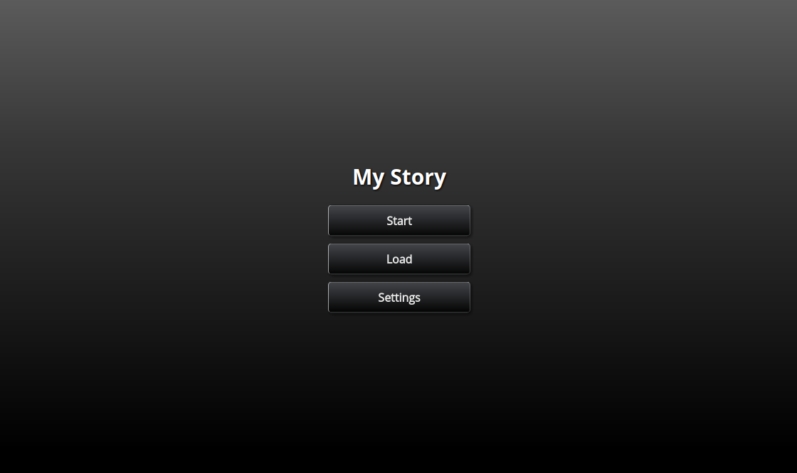

# Toothrot Engine

## What is it?

Toothrot is an engine for text-based games (interactive fiction). It helps you write
interactive stories that run in both desktop and mobile browsers or even as regular desktop
applications (Win, Mac, Linux).

Toothrot incorporates elements from many different flavors of text-driven games:

* It has a **text stream** like known from the *Lifeline* games
* Text can have **hyperlinks** like in *Twine*
* you can go from one text to **the next by clicking** anywhere on the screen or
  pressing a button like in *visual novels*
* You can have **choice buttons** below a piece of text like in *Inkle* or *ChoiceScript*
games
* You can develop your own **world model** similar to those in *text adventures*

Games are written in an **eye-friendly format** similar to *markdown*. You can use *JavaScript* to
make the games even more interactive, though knowing JavaScript is not required for
writing basic stories.

Toothrot is fully **open source** and allows developing commercial games, too.

## What does it look like?

<video src="{rootDir}docs/videos/gameplay.webm" controls poster="{rootDir}docs/videos/gameplay.png">
Sorry, your browser doesn't support embedded videos.
</video>

[Download video](file: docs/videos/gameplay.webm)

## Why and when should you use toothrot?

&#x2713; You should consider writing your game using toothrot when...

* ...you want to use both **hyperlinks** and **choice buttons** in the same game
* ...you want an easy way to go to the **next** piece of text (like in visual novels)
* ...you want to have a ready-to-use **savegame** mechanic (using browser storage or images)
* ...you've grown out of Twine and want to write something a little more complex
* ...you want to write your game with more than one person
* ...you want **keyboard navigation** in your games
* ...you need a fully **customizable screen system** (think pause or stats screen)
* ...you want to have choices with a **timer** (similar to Telltale games)
* ...you want to use background **images**, **sounds**, music or ambience
* ...you want text to appear character by character
* ...you want to develop a more involved **world model** than just using variables

&#x274c; You probably shouldn't use toothrot when...

* ...you freak out when you have to write stuff into a terminal
* ...you need an editor that hides all the technical details from you
* ...you want to display massive amounts of text at once (try ChoiceScript instead)

/---- info
Want to give the engine a try? Read the [Quick Start Guide](docs/user/guides/quick-start/index.md)!
----/
